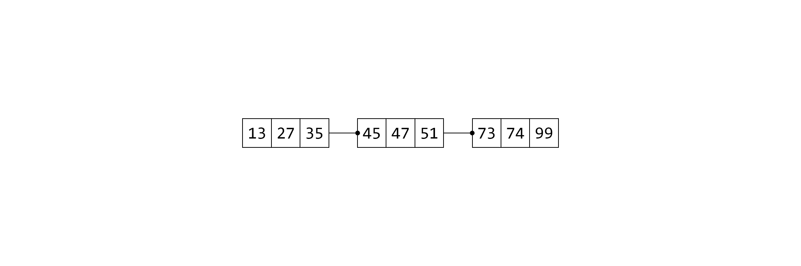
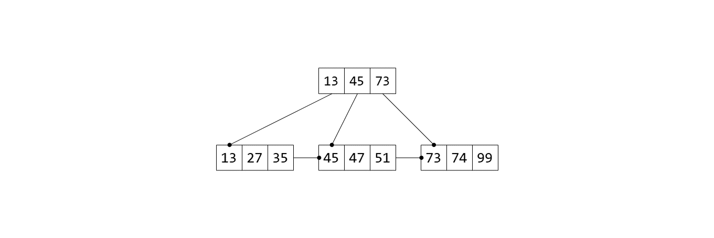
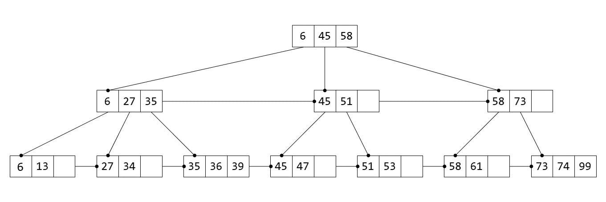
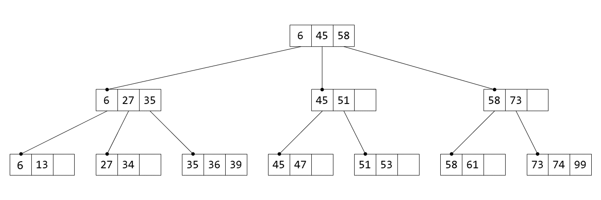

# From Linked List To B+ Tree

In this article, I'd like to show how B+ tree can be easily constructed from the simple data structures: linked list and array.

I will use a randomly generated integer number sequence as the example data: `27 45 35 73 47 74 99 13 51 6 36 34 58 39 61 53`.

## Linked List

Below is a linked list of integers, and its elements are already in ascending order.

When we want to insert an integer in this ordered linked list, we have to go through each node until we find the last element that is smaller than the integer, and we insert right after it.

## Array

As for an ordered array, this insertion process can be quite similar. The only difference is, when we find the right position to insert the integer, we should first shift the elements larger than it by one slot, and then put the integer in the now empty slot. Note that an array always has a limited number of slots, in this example, 5.

## Linked List Of Arrays

Now let's combine the linked list and the array to get a *linked list of arrays*. And let's limit the slot number of each array to 3.

When we insert an integer in this data structure, we first go through each list node, now a 3-slot array, and compare its first element with this integer, until we find the last array whose first element is smaller than the integer, and we will insert the integer in this array.

When the array to insert is full, we split the array in half after finding the correct position to insert the integer.

Here are some more examples:

## B+ Tree

By only selecting the first element of each array, we can construct another layer of linked list of arrays. There we get the B+ tree.

With the B+ tree constructed, we can now make use of it to speed up the insertion process. We first go through the root array to find the last element smaller than the integer, then we follow the link from this element down to the next level, and continue the comparison process the same way, until we find the target position at the bottom layer.

We also need to update the upper layer when array splits at the bottom layer. This is as simple as inserting the first element of the split-out array in the upper layer.

Let's take a look at another example:

This time, when an integer is inserted in the bottom layer, the array in the upper layer also splits, which causes another layer to be created as the new root layer.

This is how the final B+ tree with all the integers inserted looks like:

The element deletion operation won't be more difficult than insertion. It may just need a merge of the adjacent arrays or, at worst, the de-allocation of the root layer. I believe there's no need to elaborate.

## Afterword

Compared with the standard B+ tree, the tree I constructed is slightly different as there are extra links between the internal nodes. In fact, once the tree is constructed, all links between the nodes of the same level can be safely removed, because the next node can now be referenced through the node of a higher level. The leaf nodes only need to store the data indexes, while the internal nodes store an array of indexes paired with links to the nodes of the next level.

Links and arrays are the most fundamental structures upon which every data structure is built. Although the *linked list of arrays* is only an intermediate data structure for constructing the B+ tree, it can serve its own purposes. In fact, that's how I discovered this way of understanding the B+ tree. Initially I wanted to find a data structure to support editing long articles without having to load the entire file. So quite straightforwardly I came up with this data structure like a chain of fixed-sized pages to dynamically load a portion of the article that would be displayed on the screen, while retaining the ability to edit at any location without having to shift everything after the edit point.
