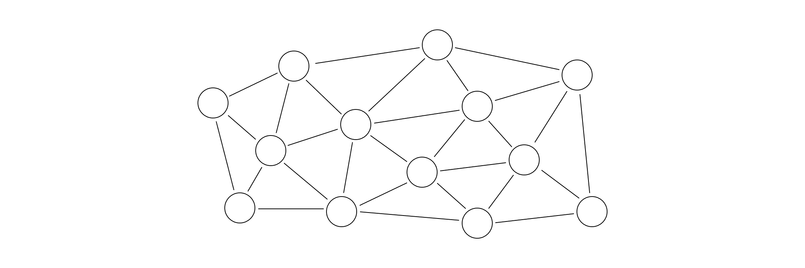
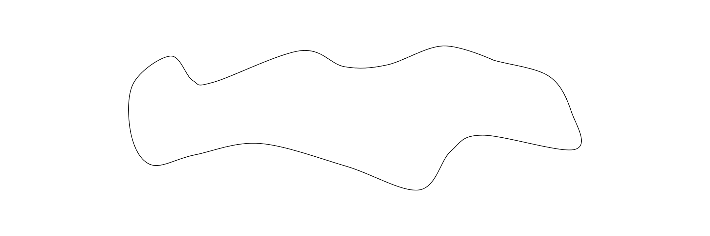

# Register Allocation On DAG

Register allocation happens when a DAG (directed acyclic graph) that represents an execution flow is being serialized.

Let's look at the example function below, assuming that all operations are just arithmetic operations on integers.

## Example: `a, b -> (a + b) * (-b)`

This function takes `a` and `b` as input parameters and outputs the result of `(a + b) * (-b)`, whose execution flow can be represented by the following DAG:

There are two possible ways of sequentially doing the calculation, one is to compute `+` first, and the other is to compute `-` first, as the animations below show. Note that once a computed value is no longer in use, the space it occupies can be freed up.

Although they will eventually produce the same result, their runtime space costs are different. The first way only requires at most two intermediate results to be stored at the same time, while the second way requires three.

Now let's define this problem formally.

## The Optimal Register Allocation Problem On DAG

With a given DAG, we define two possible states of a node: `Inactive` and `Active`.

At the beginning, only the nodes without predecessors are `Active`, which means they already contain values, while all other nodes are `Inactive` and are to be evaluated.

For each step, we choose one `Inactive` node whose all predecessors are `Active` and evaluate it, turning it to `Active`. At the same time, we check if there is any predecessor of this node whose all descendants are by now `Active`, and convert all of them back to `Inactive` to free up their spaces.

The problem is, how to choose the order in which the nodes are to be evaluated, so that the maximum number of nodes that are in `Active` state at the same time is minimized.

## Afterword

I discovered this problem when I was working on the project to implement a compiler in my Compiler Principles course a year ago.

As far as I know, finding the number of all topological sorts of a DAG is an NP-complete problem, so I reckon this problem couldn't be less difficult, but I haven't found a way of proving it yet.

## Appendix: Another Similar Interesting Problem For Any Graph

Here's also another problem I discovered independently in a completely different circumstance. Let's see an animation first:

It looks like the spreading wildfire. To put it formally, we define  three states of each node: `unburnt`, `burning` and `burnt`. All nodes are `unburnt` at the beginning. Each time we choose an `unburnt` node and make it start `burning`, and if all adjacent nodes of a `burning` node are either `burnt` or `burning`, it becomes `burnt` and can no longer be `burning` again. The problem is to find the sequence to burn all the nodes while minimizing the maximum number of `burning` nodes at the same time. For the graph above, it is four and one possible sequence is as the animation shows.

We can also define a continuous version of the same problem on any closed shape. We want to burn this patch while minimizing the maximum length of the burning line.

In fact, this is how I found out about this problem. I was eating a beef-filled pancake one morning, in the same semester I took the Compiler Principles course though, and got quite annoyed that the beef filling kept spilling out, when the question suddenly occurred to me. How could I progressively eat the whole pancake, while keeping the maximum length of the bite line as short as possible, so that less beef would be spilt out?

If the pancake is a perfect circle, the shortest maximum length will be the diameter of the circle, I presume. But if it is irregularly shaped, like the shape in the above animation, the length will not be that easy to calculate.

Based on this problem, we could probably define the `diameter` of an arbitrary graph or shape, including, of course, the DAG. Although I can't solve it now and don't know what use it is, I find it quite interesting and worth my further investigation.
