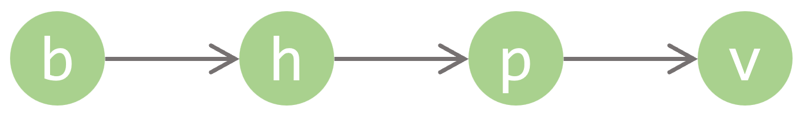
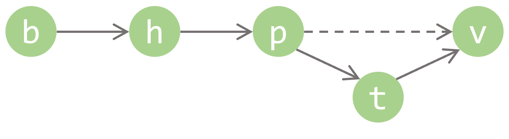

# From Linked List To B+ Tree

In this article, I'm going to show how B+ tree can be easily constructed from the simple data structures: linked list and array.

## Linked List

A list node is the basic element of the linked list. In addition to the data payload, each node also stores a reference, or a *link* to the next node, and a link to the previous node if it is a doubly linked list.

The reference is resolved by the runtime environment, or the memory management system, to actually get the node data that is referenced. Each node that is managed by the memory has a unique address for referencing. The address/reference/link is usually an intergal number with a maximum size.

Let's put the memory management system aside and simply use an arrow pointing to the next node to represent the link. Assume the payload is a character from 'a' to 'z'. A linked list may be shown as below:

### Ordered Linked List

If the data payload is comparable, the linked list can be sorted so that the elements are in order:

Now we only focus on a singly linked list of characters in ascending order.

### Finding an element

To find the character 'h', we need to go through the list from head to tail until we find a node that contains 'h'.

### Inserting an element

To insert a character 't', we need to go through the list to find the last node that is smaller than 't', which is 'p', than update its link to point to 't' and let 't' point to its former next node 'v'.

### Deleting an element

After finding the element, we update the previous node's next link to the element's next link. Then the element is removed from the linked list.

The finding, insertion or deletion all take up O(n) time complexity denpending on the length n of the list.

## Array

An array stores several data members continously and allows random access. In fact, a list node is an array that stores data as well as link to other nodes. But in this section we only talk about the array that stores data elements of the same type.

### Fixed Size Array

An array always has a fixed size, which is the maximum number of elements it can store. An array with no element is empty, and when all slots of an array are occupied with elements, it becomes full.

### Ordered Array

Similar to the linked list, if elements are comparable, the array can be sorted so that the elements are in order.
 
### Finding an element

Like that of linked list, to find an element in the array, we can go through the array from head to tail until we find an element that equals the element we want to find. This takes O(n) time.

Because array supports random access, we can use binary search to find an element more quickly. This will only take O(log(n)) time.

### Inserting an element

### Deleting an element

## Linked List Of Arrays

Now let's combine the ordered linked list and the ordered fixed size array together. We store an array in each list node, and get a list of arrays. Once you have understood this data structure, the B+ tree will no longer be as complex as it seemed to be.

### Finding an element

We still need to iterator over the entire list until the target element is found. But for each node, we only need to compare the first element of the array.

### Inserting an element

When the array is full, we can not 

### Deleting an element

## B+ Tree

### Finding an element

### Inserting an element

### Deleting an element

## Reflections

Althrough the B+ tree I constructed in this article is not strictly equivalent to the standard B+ Tree, as there are extra links between the intermidiate nodes, it is more easily to understand while preserving the basic functionality. In fact, once the tree structure is constructed, all links between the nodes of the same level can be safely removed because the next node can now be referenced through the node of a higher level. The base level nodes only need to store the actual data records, while the intermiate nodes stores an array of index field paired with the reference to the lower level nodes.

When nodes split or merge can also be adjusted. Currently each node of the B+ tree contains

Linked list and fixed size array are the most fundamental data structures. There are no unlimited storage systems. The physical memory and the disks are always partitioned by *pages*, usually of 4KB size, and an internet package might even be smaller. Data exceeding this size limit can only be stored across multiple pages linked with references. Thus all data structures are constructed. Of course each link or reference also takes up a fixed size, so only a limited size of pages can be eventually managed. Althrough this would be a large number, it is still not infinite.

The *Linked List Of Arrays* data structure can also be useful in some occasions, like dynamically loading a long list of records, or paragraphs. You don't want to load the entire table or article because only a limited size of records or paragraphs can be shown on the screen at the same time. You may only need to go through the paragraphs from head to tail and not from the middle, and make certain modifications on the paragraphs that you are currently reviewing. Of course you can simply use a linked list, but it's not the best way as each list node only occupies several bytes of an entire disk page. You want to make full use of a disk page, so you store a fixed-size array inside a single list node which occupies an entire page.
